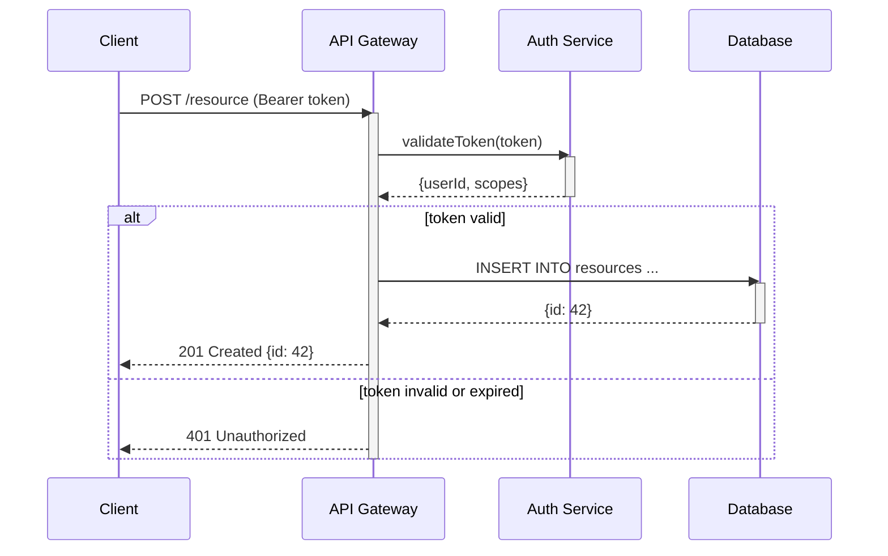

<!-- RFC 2119: MUST, MUST NOT, SHOULD, SHOULD NOT, MAY -->

# Convention: Mermaid (tool.mermaid)

Authoring standards for Mermaid diagrams in documentation and specs. For the
high-level decision of when to use Mermaid vs. ASCII art, and for fenced code block
syntax, see `process.diagrams`.

## Diagram Type Selection

1. Flowcharts (`flowchart`) MUST be used for processes, decision trees, and component
   relationships.
2. Sequence diagrams (`sequenceDiagram`) MUST be used for API calls, message flows,
   and multi-actor interactions.
3. State diagrams (`stateDiagram-v2`) MUST be used for state machines and lifecycle
   models.
4. Entity-relationship diagrams (`erDiagram`) MUST be used for database schemas and
   data models.
5. Class diagrams (`classDiagram`) SHOULD be used for OOP type hierarchies and
   interface relationships.
6. `gitGraph` SHOULD be used for illustrating branching strategies or release flows.
7. `timeline` MAY be used for project milestones and roadmaps.
8. Authors MUST NOT use a diagram type as a workaround — choose the type whose
   semantics match the information being modelled.

## Flowchart Syntax

9. Authors MUST use the `flowchart` keyword instead of the legacy `graph` keyword for
   new diagrams.
10. Flowcharts with more than 4 nodes in a single chain MUST use `TD` or `TB`
    direction, not `LR` (see also `process.diagrams` rule 6).
11. When `flowchart LR` is used, the longest chain MUST NOT exceed 4 nodes
    (supersedes `process.diagrams` rule 7, which references the legacy `graph LR`
    syntax).
12. Long node chains MUST be declared as separate edge statements (`A --> B` then
    `B --> C`) rather than a single chained expression, to keep diffs readable and
    prevent rendering truncation (supersedes `process.diagrams` rule 8, which
    uses SHOULD).
13. Node labels MUST use quoted strings (`A["label"]`) — Mermaid requires quoted
    strings for labels containing spaces or special characters; quoted strings are
    best practice for all other labels.
14. Node IDs SHOULD use SCREAMING_SNAKE_CASE for readability in raw source.
15. Subgraphs SHOULD be used to group logically related nodes in large diagrams.
16. Decision nodes MUST use the diamond syntax (`{condition}`) and MUST include a
    labeled edge for each branch (e.g., `-->|yes|` and `-->|no|`).

## Sequence Diagram Conventions

17. Actor names MUST be short and descriptive (e.g., `Client`, `API`, `DB`).
18. `participant` declarations MUST appear at the top of the diagram in the order
    actors first appear.
19. `activate`/`deactivate` SHOULD be used for request-response pairs to show
    processing time.
20. `alt`, `else`, `opt`, and `loop` blocks MUST include a descriptive label.
21. Long sequences SHOULD be split into separate diagrams at logical boundaries (e.g.,
    authentication flow vs. data retrieval flow).

## State Diagram Conventions

22. Authors MUST use `stateDiagram-v2` — not the legacy `stateDiagram`.
23. State names MUST be descriptive nouns or noun phrases (e.g., `Idle`,
    `Processing`, `Failed`).
24. Transition labels SHOULD describe the event or condition that triggers the
    transition.
25. Composite states SHOULD be used (nested `state` blocks) when a state contains
    sub-states with their own lifecycle.

## Syntax and Formatting

26. Each diagram MUST begin with its diagram type keyword on the first line of the
    block.
27. Node and actor identifiers MUST be unique within a diagram.
28. Arrow types MUST reflect semantics:
    - `-->` for standard data flow or event sequence
    - `-.->` for optional or asynchronous flow
    - `==>` (thick) for critical path or primary flow
    - `--o` / `--x` for association / inhibition in flowcharts
29. Comments (`%% comment`) SHOULD be used to annotate non-obvious structure within
    complex diagrams.

## Rendering and Compatibility

30. Diagrams MUST be verified to render correctly on GitHub's Markdown renderer before
    committing.
31. GitHub's content column is approximately 880 px wide; `LR` flowcharts with long
    chains MUST NOT be used as they overflow or compress into unreadable thumbnails.
32. Authors MUST NOT rely on Mermaid CSS class overrides (`classDef`/`class`) for
    information that is critical to understanding the diagram — colour and style are
    cosmetic and may not render in all contexts.
33. When a diagram appears in a context that may not support Mermaid rendering (e.g.,
    terminal output, plain-text email), a plain ASCII fallback SHOULD be provided per
    `process.diagrams` rule 12.

## Placement and Documentation

34. Every diagram MUST be preceded by a sentence or heading that identifies what it
    shows.
35. Diagrams in specs and RFCs MUST appear adjacent to the text they illustrate — not
    appended as an appendix unless the diagram spans multiple concepts.
36. Authors MAY link to the Mermaid Live Editor for complex diagrams to allow
    interactive exploration, but the diagram source MUST also be embedded inline.

## Golden Example

### Flowchart (rules 9, 10, 12, 13, 14, 16)

Deployment pipeline with a manual approval gate:

```mermaid
flowchart TD
    %% Build phase
    SOURCE["Source Push"] --> BUILD["Build & Test"]
    BUILD --> GATE{"Tests pass?"}

    GATE -->|yes| STAGING["Deploy to Staging"]
    GATE -->|no|  FAIL["Notify & Halt"]

    STAGING --> APPROVAL{"Approved?"}
    APPROVAL -->|yes| PROD["Deploy to Production"]
    APPROVAL -->|no|  ROLLBACK["Rollback Staging"]
```

### Sequence Diagram (rules 17, 18, 19, 20)

Token-authenticated API request:

